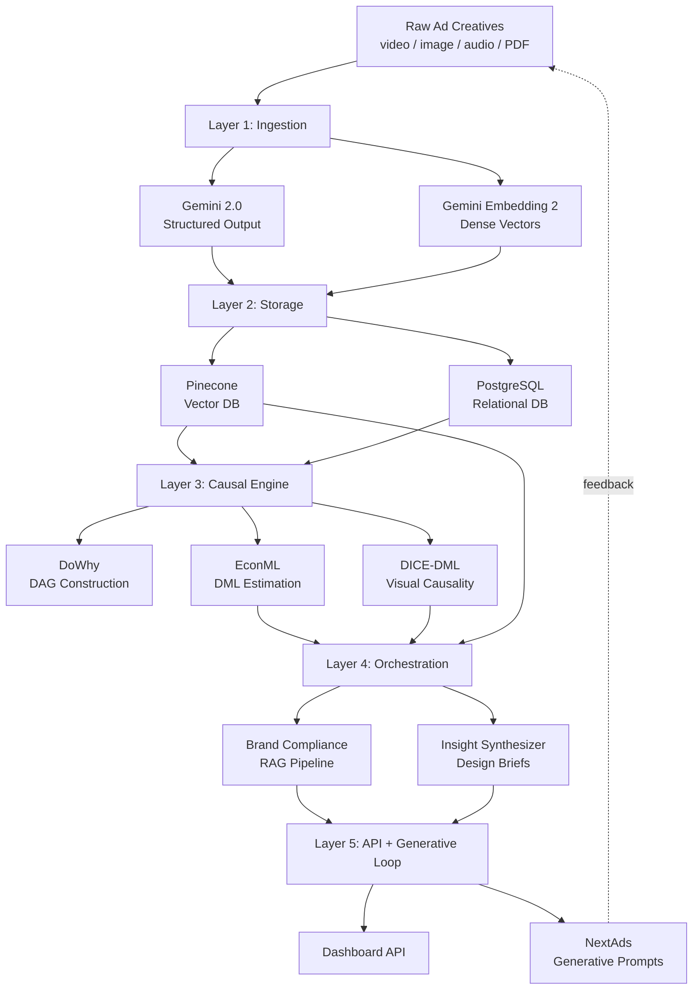

# OmniProof

OmniProof is an open-source, causal-multimodal attribution engine for digital advertising. It transitions marketing analytics from a correlational paradigm (measuring *what* happened) to a rigorous causal framework (proving *why* it happened).

## What It Does

- **Ingests** video, image, audio, and PDF ad creatives via Google Gemini Embedding 2
- **Extracts** structured metadata (visual elements, pacing, CTA type, audio tone) using Gemini 2.0 Structured Output
- **Estimates** true causal effects of creative features on performance using Double Machine Learning
- **Disentangles** visual confounders from treatment signals via DICE-DML (Causal Representation Learning)
- **Enforces** brand compliance through multimodal RAG against corporate guidelines
- **Generates** optimized creative prompts parameterized by proven causal insights

## Architecture



### Layer Summary

| Layer | Purpose | Key Components |
|:------|:--------|:---------------|
| **1. Ingestion** | Transform raw creatives into structured data + embeddings | `AssetPreprocessor`, `GeminiClient`, `IngestPipeline` |
| **2. Storage** | Dual store for vectors and structured data | `PineconeVectorStore`, `RelationalStore` |
| **3. Causal Engine** | Estimate true causal effects, not correlations | `CausalDAGBuilder`, `DMLEstimator`, `CausalRefuter`, `VisualDMLEstimator` |
| **4. Orchestration** | Brand compliance + insight synthesis | `ComplianceChain`, `InsightSynthesizer` |
| **5. API + Generative** | Serve insights, generate optimized creative prompts | FastAPI routes, `GenerativePromptBuilder` |

## Quick Start

```bash
# Clone and install
git clone https://github.com/navidgh66/omni_proof.git
cd omni_proof
python -m venv .venv && source .venv/bin/activate
pip install -e ".[dev]"

# Configure
cp .env.example .env
# Edit .env with your Gemini and Pinecone API keys

# Run tests
pytest -v

# Start the API
uvicorn omni_proof.api.app:create_app --factory --reload
```

## API Endpoints

| Method | Endpoint | Description |
|:-------|:---------|:------------|
| `GET` | `/health` | Health check |
| `GET` | `/api/v1/causal/effects` | List all estimated causal effects |
| `GET` | `/api/v1/causal/effects/{treatment}` | CATE breakdown by segment |
| `POST` | `/api/v1/causal/analyze` | Trigger new causal analysis |
| `POST` | `/api/v1/compliance/check` | Upload creative for brand review |
| `GET` | `/api/v1/compliance/reports` | Historical compliance reports |
| `GET` | `/api/v1/insights/briefs` | Latest design briefs from causal data |
| `GET` | `/api/v1/insights/segments` | Effects filtered by audience segment |
| `POST` | `/api/v1/generative/prompt` | Generate optimized creative prompt |

## Causal Methodology

OmniProof uses a four-stage causal pipeline:

1. **Model** -- Construct a Directed Acyclic Graph (DAG) mapping treatments, outcomes, and confounders
2. **Identify** -- Apply the backdoor criterion to find valid adjustment sets
3. **Estimate** -- Double Machine Learning (Neyman Orthogonalization) via EconML to isolate true effects
4. **Refute** -- Placebo tests, subset validation, and random confounder checks to reject spurious findings

For visual embeddings where treatment and confounders are entangled, **DICE-DML** generates deepfake counterfactual pairs, extracts treatment fingerprints via vector subtraction, and applies orthogonal projection to disentangle the representation before estimation.

## Example Output

```
CAUSAL INSIGHT: Fast Pacing in Opening 3 Seconds

FINDING: Increasing video pacing in the first 3 seconds causes a
+12.0% uplift in CTR for the 18-24 demographic (CI: 8-16%, p<0.001),
independent of production quality, platform, and seasonal timing.

SEGMENT BREAKDOWN:
- 18-24: +12.0% -- RECOMMENDED
- 25-34: +5.0% -- CONSIDER
- 35-44: -2.0% -- NEUTRAL

CONFIDENCE: HIGH (all refutation checks passed)
```

## Tech Stack

| Component | Technology |
|:----------|:-----------|
| Embeddings | Google Gemini Embedding 2 (`gemini-embedding-2-preview`) |
| Structured extraction | Google Gemini 2.0 Flash |
| Vector database | Pinecone Serverless |
| Relational database | PostgreSQL (prod) / SQLite (dev) |
| Causal inference | DoWhy + EconML (LinearDML, CausalForestDML) |
| Visual causality | DICE-DML (orthogonal projection) |
| API framework | FastAPI |
| ML models | LightGBM (first-stage nuisance models) |
| Schemas | Pydantic v2 + SQLAlchemy 2.0 |

## Gemini Embedding 2 Limits

| Modality | Constraint |
|:---------|:-----------|
| Text | 8,192 tokens |
| Images | 6 per request |
| Video | 80s (with audio) / 120s (without) |
| Audio | 80s max |
| PDF | 1 doc, 6 pages |
| Output | 3,072 dimensions (Matryoshka: truncate to 1536/768/128) |

## Docker

```bash
docker-compose up -d    # Start API + PostgreSQL
curl localhost:8000/health
```

## Testing

```bash
pytest tests/unit/ -v         # 93 unit tests
pytest tests/integration/ -v  # 15 integration tests
pytest -v                     # All 108 tests
```

## Project Structure

```
src/omni_proof/
  config/           Settings and constants
  ingestion/        Gemini client, preprocessor, schemas, pipeline
  storage/          Pinecone vector store, SQLAlchemy relational store, ORM models
  causal/           DAG builder, DML estimator, refuter, results
    dice_dml/       Counterfactual generator, disentangler, visual estimator
  rag/              Brand indexer, retriever, models
  orchestration/    Compliance chain, insight synthesizer
  api/              FastAPI app, routes, generative prompt builder
tests/
  unit/             93 unit tests
  integration/      15 E2E tests
  fixtures/         Synthetic data generators
plans/              Blueprint and layer specs
  specs/            Detailed specs per architectural layer
```

## License

MIT
